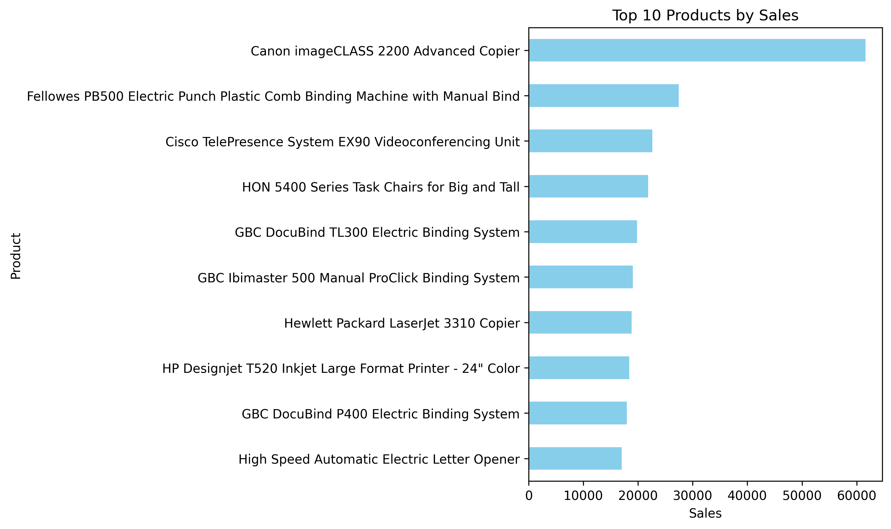
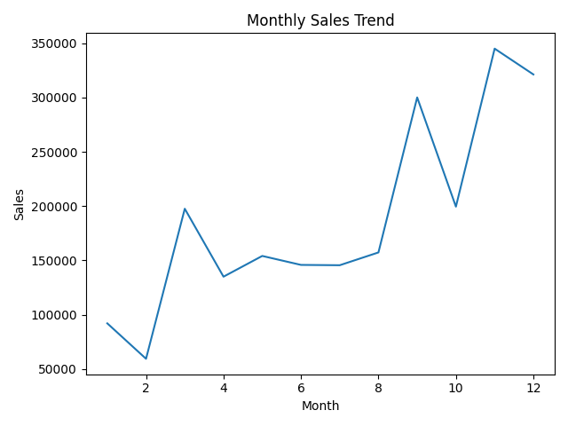

# 📊 Sales Data Analysis & Dashboard

## 🚀 Overview

This project analyzes sales data using Python and Excel to generate business insights.

## 🛠 Tools

* Python (Pandas, NumPy, Matplotlib)
* Excel (Dashboard)

## 📊 Visuals

## 📁 Files

* analysis.py
* sales_data.csv
* cleaned_sales_data.csv
* sales_dashboard.xlsx

## ✅ Key Insights

* Identified top-selling products
* Analyzed monthly sales trends
* Cleaned and structured raw data

## 🎯 Outcome

Demonstrates real-world data analysis and visualization skills.
